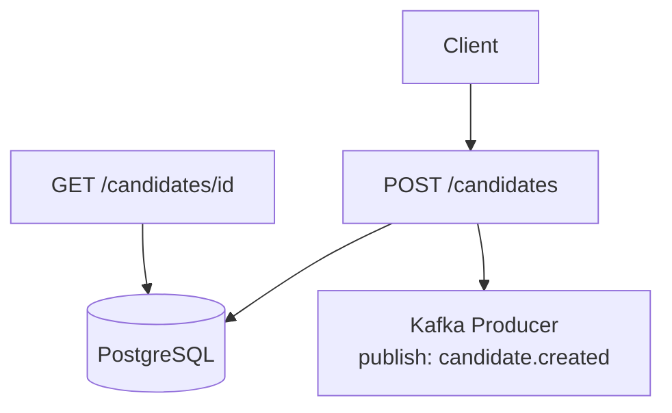

# Candidate API

O Candidate API é o microsserviço responsável por receber candidatos via REST, armazená-los no banco relacional e publicar um evento candidate.created no Kafka para processamento posterior.
Ele é a entrada do ecossistema, garantindo baixa latência e isolamento do pipeline pesado.

🎯 Objetivos

* Receber candidatos via HTTP
* Persistir dados brutos no PostgreSQL
* Publicar evento candidate.created
* Operar com baixa latência
* Servir consultas de status

🧱 Tecnologias

* Java 21+
* Spring Boot 3
* Spring Web
* Spring Data JPA
* PostgreSQL
* Kafka Producer
* Docker Compose

🏗 Arquitetura — Candidate API

